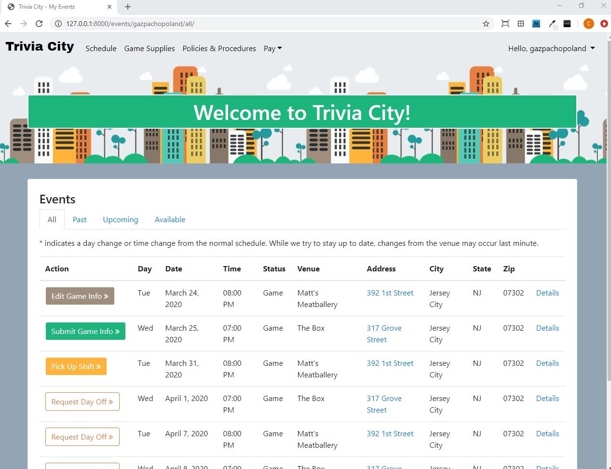

[](https://python.org)
[](https://djangoproject.com)

# Trivia Company - web application

## Table of Contents

* [General Info](#general-info)
* [Screenshot](#screenshot)
* [Technologies](#technologies)
* [Setup](#setup)
* [Features](#features)
* [Project Status](#project-status)
* [Inspiration](#inspiration)
* [Contact](#contact)

## General Info
This is a web application for a trivia company.

The public facing site allows customers to view company info and scheduling information in real time.

The employee site centralizes all company emcees' needs - including scheduling, access to game supplies, submission of event info, as well as policies and payroll.

The administrative site (customized built-in Django admin interface) allows for the management of several aspects of the company - including venue, employee, schedule, and payroll management.

## Screenshot


## Technologies
* Python 3.6.4
* Django 2.2 
* Bootstrap 4
* JQuery 3.2.1
* Javascript
* HTML
* CSS

## Setup
To run the project on your local machine:

1. Clone the repository:
```
git clone https://github.com/cpadiernos/triviacompany.git
```

2. Install the requirments:
```
pip install -r requirements.txt
```

3. Create the database:
```
python manage.py migrate
```

4. Create the user for the admin site:
```
python manage.py createsuperuser
```

4. Run the development server:
```
python manage.py runserver
```

5. Navigate to http://127.0.0.1:8000/admin and enter the information of the superuser you created earlier. Then fill in relevant information including users, venues, and events.

To view public site, go to http://127.0.0.1:8000/
To view the emcee site, go to http://127.0.0.1:8000/login

Demo at [Trivia City](https://triviacityevents.com)

## Features
Public site:
* (General) About page and how to play
* Events filter by state, city and/or day
* Real time event status
* Real time host bio and pic display

Emcee site:
* Login required file downloads
* Real time game file access
* Real time schedule updates
* Request off and pick up shift functionality
* Time triggered game info submission forms
* Automatic pay calculation and pay stub assignment
* Reimbursement request forms, real time approval notice and pay stub assignment
* Real time policy & procedures updates
* Account update, password reset functionality
* Automatic profile image rotation, resizing, and cropping

Admin site:
* User profiles by role
* Dynamic pay structure settings for emcees
* Dynamic billing structure settings for venues
* Automatic pay calculations and corrections
* Relevant filters for easy management
* Schedule generator

To-dos:
* Add forum for emcees
* Add application for event statistics
* Add functionality to order game supplies
* Add functionality to order equipment
* Add site for regional managers - manage regional employees, regional venues, equipment and game supplies
* Add site for venue managers - manage venue events, venue invoices, marketing supplies, direct contact their regional manager
* Add site for accounting - manage payments and invoices
* Add application for inventory management -  game supplies and equipment
* Add application for players - check winning stats, recruit players, suggest topics, dispute questions

## Project Status
The project can be used as is for a small trivia company. Unit tests are included and passing for the current version.

In the process of adding user friendly way to customize defaults and appearance. Sample company "Trivia City" files included with repo for demo on local machine.

Features will be added regularly.

## Inspiration
As a former trivia emcee and then trivia company manager, I thought this would be a great tool to streamline the entire process.

## Contact
Created by [@cpadiernos](). Feel free to reach out!
